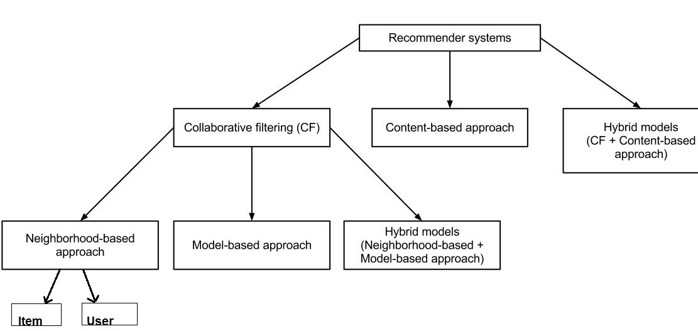

2 Types of recommender systems are 
* Content-Based -->determine how similar a pair of items are based on their metadata tags
* Collaborative Filtering --> recommend new items based on the actions of users

Content based recommender systems use the features of items to recommend other similar items. For example, if I’m browsing for solid colored t-shirts on Amazon, a content based recommender might recommend me other t-shirts or solid colored sweatshirts because they have similar features (sleeves, single color, shirt, etc.).

CF can be divided into 
* Model-Based Collaborative filtering -->performed by different machine learning algorithms
* Neighbourhood/Memory-Based Collaborative Filtering 
	1.User based -->Users who are similar to you also liked
	Similarity values are measured by observing all the items rated by users.
	2.Item based -->Users who liked this item also liked
	Similarity values are measured by observing all the users who have rated items.

User based -->create a user-item matrix
Item Based -->create a item-user matrix